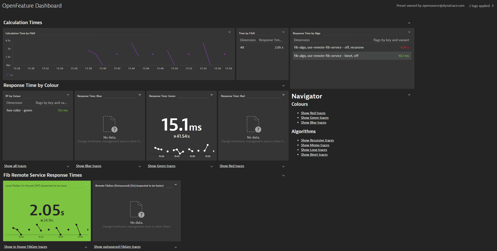

# OpenFeature Observability Clinic

This repo is the companion to [this video](https://www.youtube.com/watch?v=efP2AqZ4BMg) and [this blog post](https://example.com/TODO).

## Preparation

You will need:

- A Linux VM with [docker](https://docs.docker.com/engine/install/) and [docker compose](https://docs.docker.com/compose/install/linux/) installed
- A Dynatrace environment ([sign up for a free trial](https://dynatrace.com/trial))

# Gather Dynatrace Details
1. Make a note of your Dynatrace environment URL (e.g. `https://abc12345.live.dynatrace` **without** the trailing slash)
2. Create a new Access Token with the following permissions: `ReadConfig`, `WriteConfig`, `settings.write`, `Create and read synthetic monitors, locations, and nodes`, `CaptureRequestData`

# Clone Repository
Clone this repository to the Linux VM:

```
cd ~
git clone https://github.com/agardnerIT/openfeature-perfclinic1
cd ~/openfeature-perfclinic1
```

# Set DT Environment Details

Modify the following with your details and run:
```
export DT_ENVIRONMENT=https://abc12345.live.dynatrace.com # Note: without trailing slash
export DT_TOKEN=dtc01.*****.*****
export VM_IP=1.2.3.4
```

## Why do the above details have to be set?
These variables are used later by Monaco to parameterise your Dynatrace configuration.

- `DT_ENVIRONMENT` and `DT_TOKEN` are used to know where Monaco should apply the config (i.e. Which DT environment)
- `VM_IP` is used to set the application detection rule so [RUM data](https://www.dynatrace.com/support/help/how-to-use-dynatrace/real-user-monitoring) is routed to the correct DT application


# Monitor Span Attributes
The OpenFeature demo contains 3 important span attributes.

Tell Dynatrace to automatically capture and store the values.

```
chmod +x ~/openfeature-perfclinic1/scripts/trackSpanAttributes.sh
~/openfeature-perfclinic1/scripts/trackSpanAttributes.sh $DT_ENVIRONMENT $DT_TOKEN
```

Note: you may receive `401` responses if some / all of those span attributes are already monitored. That's OK, just proceed.

# Install OneAgent
Install a FullStack OneAgent: Go to your environment and click on "Deploy Dynatrace" > "Start Installation" > "Linux".

Best practice: Always set a host group. For example: `openfeature-demo`

Your installation command should look similar to this:
```
sudo /bin/sh Dynatrace-OneAgent-Linux-1.***.***.sh --set-infra-only=false --set-app-log-content-access=true --set-host-group=openfeature-demo
```

# Clone and Start OpenFeature Demo
```
cd ~
git clone https://github.com/open-feature/playground
cd playground
docker compose up --detach
```

The OpenFeature demo should now be accessible via a browser on port `30000` of your Linux VM.

# Apply Dynatrace Configuration

Finally, apply the Dynatrace configuration using [Monaco](https://dynatrace-oss.github.io/dynatrace-monitoring-as-code/).

First, change directory to the `monaco` folder and download [the latest Monaco binary](https://github.com/dynatrace-oss/dynatrace-monitoring-as-code/releases) to that directory:

```
cd ~/openfeature-perfclinic1/monaco
wget -O monaco https://github.com/dynatrace-oss/dynatrace-monitoring-as-code/releases/download/v1.8.7/monaco-linux-amd64
chmod +x monaco
export NEW_CLI=1
./monaco deploy -e environments.yaml
```

This will automatically create the following pieces of configuration:

- An application & detection rules
- Auto tagging rules
- Calculate service metrics and request attributes based on the span attribute values capture from OpenTelemetry
- A management zone
- 2x synthetic monitors

# View Data in Dynatrace

Go to "Dashboards" and look for "OpenFeature Dashboard". In a few moments, you should see data flowing into the system (some tiles will be blank - that's OK).



Modify the flags in the demo system `http://VM_IP:30000` and the dashboard should automatically track and report your changes.

# Problems or Issues?

Please create an Issue and

Maintained by [Adam Gardner](https://www.linkedin.com/in/agardner1/)